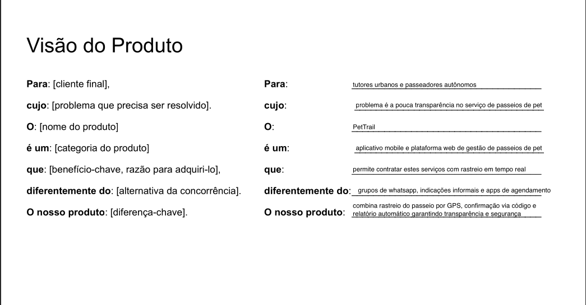
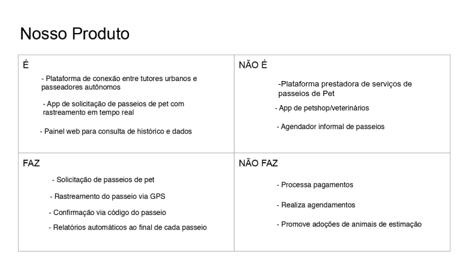

# 2. Nosso Produto
O PetTrail é uma plataforma mobile e web voltada para a conexão entre tutores de pets e passeadores autônomos. O produto oferece rastreamento em tempo real do trajeto percorrido durante o passeio, confirmação presencial da retirada do animal e geração automática de relatórios ao término de cada serviço. Esta seção apresenta a visão estratégica do produto, sua proposta de valor e os perfis de usuários que orientaram as decisões de design e desenvolvimento.
## 2.1 Visão do Produto

## 2.2 Nosso Produto

## 2.3 Personas

<h2>Persona 1</h2>
<table>
  <tr>
    <td style="vertical-align: top; width: 150px;">
      
    </td>
    <td style="vertical-align: top; padding-left: 10px;">
      <strong>Nome:</strong> Carla Mendes  
      <strong>Idade:</strong> 34 anos  
      <strong>Hobby:</strong> Passear ao ar livre com seu cachorro  
      <strong>Trabalho:</strong> Analista de marketing em home office  
      <strong>Personalidade:</strong> Protetora, ansiosa e exigente  
      <strong>Sonho:</strong> Garantir qualidade de vida e segurança para seu pet  
      <strong>Dores:</strong> Não sabe onde seu cachorro está durante o passeio, não confia em passeadores desconhecidos e sente culpa por não ter tempo de passear com o pet sozinha  
    </td>
  </tr>
</table>

<h2>Persona 2</h2>
<table>
  <tr>
    <td style="vertical-align: top; width: 150px;">
      
    </td>
    <td style="vertical-align: top; padding-left: 10px;">
      <strong>Nome:</strong> Lucas Ferreira  
      <strong>Idade:</strong> 24 anos  
      <strong>Hobby:</strong> Treinar em parques e ouvir podcasts  
      <strong>Trabalho:</strong> Passeador autônomo de pets  
      <strong>Personalidade:</strong> Comunicativo, responsável e independente  
      <strong>Sonho:</strong> Ter renda estável e flexível sem depender de chefe  
      <strong>Dores:</strong> Dificuldade em encontrar clientes fixos, falta de credibilidade por não ter histórico comprovado e ausência de uma ferramenta que mostre seu trabalho de forma profissional  
    </td>
  </tr>
</table>

<h2>Persona 3</h2>
<table>
  <tr>
    <td style="vertical-align: top; width: 150px;">
      
    </td>
    <td style="vertical-align: top; padding-left: 10px;">
      <strong>Nome:</strong> Roberto Alves  
      <strong>Idade:</strong> 32 anos  
      <strong>Hobby:</strong> Assistir futebol e cuidar do jardim  
      <strong>Trabalho:</strong> Gerente comercial  
      <strong>Personalidade:</strong> Cauteloso, tradicional e pai de família  
      <strong>Sonho:</strong> Se aposentar tranquilo com a família e seus dois golden retrievers  
      <strong>Dores:</strong> Pouca familiaridade com apps, desconfia de prestadores que não conhece pessoalmente e já teve experiência ruim com passeador que sumiu sem dar satisfação  
    </td>
  </tr>
</table>

<h2>Persona 4</h2>
<table>
  <tr>
    <td style="vertical-align: top; width: 150px;">
      
    </td>
    <td style="vertical-align: top; padding-left: 10px;">
      <strong>Nome:</strong> Isabela Castro  
      <strong>Idade:</strong> 19 anos  
      <strong>Hobby:</strong> Fotografar animais e postar nas redes sociais  
      <strong>Trabalho:</strong> Passeadora de pets e estudante de Medicina Veterinária  
      <strong>Personalidade:</strong> Empática, dedicada e cheia de energia  
      <strong>Sonho:</strong> Abrir uma clínica veterinária própria no futuro  
      <strong>Dores:</strong> Recebe pagamentos de forma desorganizada, não tem como comprovar a qualidade do seu serviço para novos clientes e perde tempo combinando tudo pelo WhatsApp sem nenhuma gestão centralizada  
    </td>
  </tr>
</table>
