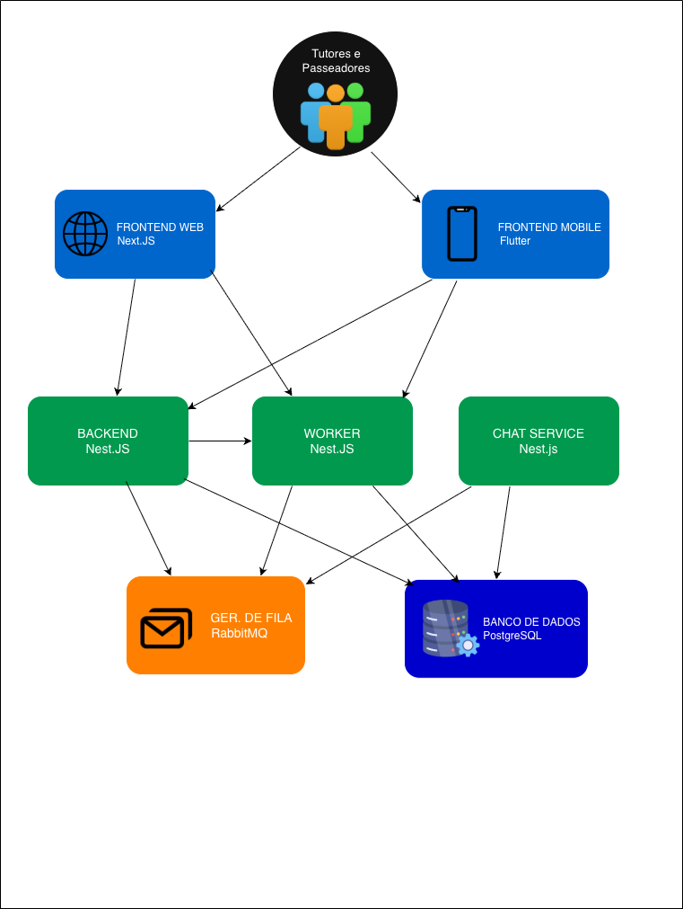
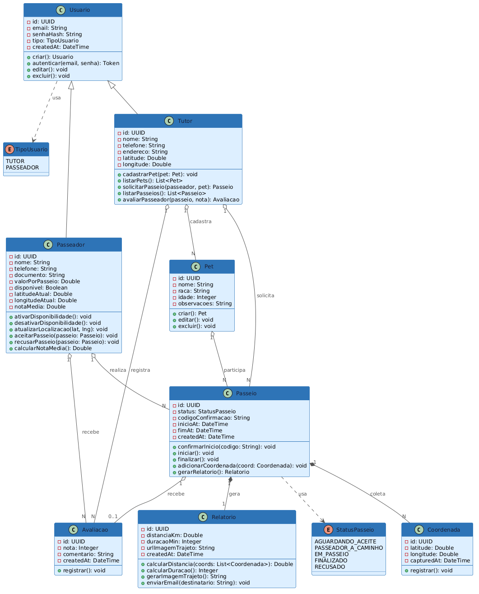
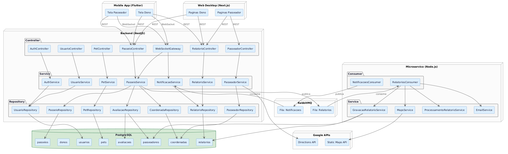

# 4. Modelagem e Projeto Arquitetural

O PetTrail é composto por cinco elementos principais distribuídos em três
ambientes de hospedagem. O Frontend Web (Next.js), hospedado na Vercel, e
o Frontend Mobile (Flutter), distribuído via Google Play e Apple Store,
comunicam-se com o Backend (NestJS), hospedado no Render, via REST e
WebSocket respectivamente. O Backend centraliza toda a lógica da aplicação
e se conecta a dois serviços hospedados na AWS: o Gerenciador de Filas
(RabbitMQ via Amazon MQ) e o Banco de Dados (PostgreSQL via RDS). O
Microserviço de Relatórios (Node.js), também hospedado no Render, consome
as filas do RabbitMQ para processar os dados ao finalizar cada passeio —
calculando métricas, gerando a imagem do trajeto e gravando o resultado no
banco de dados.

**Figura 1 - Visão Geral da Solução. Fonte: o próprio autor.**

---

## 4.1. Histórias de Usuário

As histórias de usuário foram definidas a partir dos dois perfis da plataforma: o tutor do pet e o passeador autônomo.

| EU COMO... `PERSONA` | QUERO/PRECISO ... `FUNCIONALIDADE` | PARA ... `MOTIVO/VALOR` |
|---|---|---|
| Tutor do pet | Me cadastrar na plataforma informando meus dados e os dados do meu pet | Ter acesso aos passeadores disponíveis na minha região |
| Tutor do pet | Visualizar passeadores disponíveis no mapa filtrados por raio de alcance | Escolher um passeador próximo de forma rápida e prática |
| Tutor do pet | Ver o nome, nota média, tempo médio de passeio e valor de cada passeador | Tomar uma decisão informada antes de solicitar o passeio |
| Tutor do pet | Solicitar um passeio imediato para um passeador específico | Contratar o serviço de forma direta e sem intermediários |
| Tutor do pet | Receber um código de confirmação quando o passeador aceitar a solicitação | Confirmar presencialmente a identidade do passeador ao chegar |
| Tutor do pet | Ver o horário previsto de chegada do passeador após o aceite | Me organizar e saber quando o passeador estará na minha porta |
| Tutor do pet | Acompanhar o trajeto do meu pet em tempo real no mapa durante o passeio | Ter tranquilidade e visibilidade sobre onde meu pet está |
| Tutor do pet | Receber uma notificação e um relatório automático ao fim do passeio | Ter comprovação do serviço prestado com mapa, distância e duração |
| Tutor do pet | Avaliar o passeador de 1 a 5 após cada passeio concluído | Contribuir com a reputação da comunidade e ajudar outros tutores |
| Tutor do pet | Acessar o histórico de passeios e relatórios no painel web desktop | Consultar passeios anteriores a qualquer momento em qualquer dispositivo |
| Passeador | Me cadastrar na plataforma informando meus dados, documentação e valor por passeio | Ter visibilidade para tutores de pets da minha região |
| Passeador | Ativar e desativar minha disponibilidade pelo app | Controlar quando quero receber solicitações de passeio |
| Passeador | Receber notificações de solicitação de passeio em tempo real | Aceitar ou recusar rapidamente sem precisar ficar verificando o app |
| Passeador | Confirmar o início do passeio digitando o código fornecido pelo tutor | Garantir que o tutor sabe que sou o passeador correto antes de iniciar |
| Passeador | Iniciar o rastreamento GPS ao começar o passeio | Permitir que o tutor acompanhe o trajeto em tempo real |
| Passeador | Finalizar o passeio pelo app ao devolver o pet | Encerrar o rastreamento e acionar a geração automática do relatório |
| Passeador | Acessar meu histórico de passeios e métricas mensais no painel web desktop | Acompanhar meu desempenho e construir um histórico profissional verificável |

---

## 4.2. Visão Lógica

Os artefatos apresentados a seguir descrevem a estrutura lógica do PetTrail em dois níveis: o diagrama de classes representa as entidades do domínio e seus relacionamentos internos, enquanto o diagrama de componentes descreve a organização arquitetural do sistema e as interfaces entre seus módulos.

### Diagrama de Classes

O diagrama de classes abaixo representa as principais entidades do domínio do PetTrail e seus relacionamentos. A classe `Usuario` centraliza a autenticação e é especializada em `Tutor` e `Passeador`. Um `Tutor` pode ter múltiplos `Pet`s e solicitar múltiplos `Passeios`. Um `Passeador` possui um atributo `disponivel` gerenciado automaticamente pelo sistema conforme o ciclo de vida do passeio. Cada `Passeio` agrega uma coleção de `Coordenada`s coletadas durante o rastreamento GPS, gera um `Relatorio` ao ser finalizado e pode receber uma `Avaliacao` do tutor.

**Figura 2 – Diagrama de Classes. Fonte: o próprio autor.**
 
### Diagrama de Componentes

O diagrama de componentes abaixo ilustra a arquitetura do PetTrail dividida em cinco nós principais: os dois frontends, o backend unificado, o microserviço de processamento e a infraestrutura de dados.

**Figura 3 – Diagrama de Componentes. Fonte: o próprio autor.**

Conforme o diagrama apresentado na Figura 3, os componentes participantes da solução são:

- **Mobile App (Flutter)** — app operacional para tutores e passeadores. Responsável pela solicitação de passeio, acompanhamento em tempo real via WebSocket, rastreamento GPS em segundo plano com `geolocator` e `flutter_background_service`, e visualização do relatório final. Comunica-se com o backend via REST e WebSocket.

- **Web Desktop (Next.js)** — painel de consulta acessado por tutores e passeadores. Exibe histórico de passeios, relatórios com mapa do trajeto e métricas mensais. Renderização condicional por perfil a partir de uma URL única após autenticação. Comunica-se com o backend exclusivamente via REST.

- **Backend (NestJS)** — núcleo da aplicação, organizado em três camadas internas: Controllers (recebem e roteiam requisições REST e eventos WebSocket), Services (contêm a lógica de negócio) e Repositories (abstraem o acesso ao banco de dados). É responsável por gravar e consultar dados no PostgreSQL, gerenciar as conexões WebSocket para notificações em tempo real e publicar eventos na fila `Relatorios` do RabbitMQ ao finalizar um passeio.

- **Microserviço (Node.js)** — worker assíncrono que consome a fila `Relatorios` do RabbitMQ. Ao receber o payload de conclusão de um passeio, calcula distância e duração via fórmula de Haversine, gera a imagem PNG do trajeto chamando a Static Maps API do Google, grava o relatório no PostgreSQL, envia o e-mail ao tutor e publica um evento na fila `Notificacoes` para que o backend dispare o pop-up via WebSocket.

- **PostgreSQL (AWS RDS)** — banco de dados relacional que persiste todas as entidades do sistema: usuarios, tutores, passeadores, pets, passeios, coordenadas, relatorios e avaliacoes. Instância gerenciada em VPC privada na AWS.

- **RabbitMQ (AWS Amazon MQ)** — broker de mensageria com duas filas: `Relatorios` (backend → microserviço) e `Notificacoes` (microserviço → backend). Desacopla o processamento pesado do fluxo principal, garantindo que a finalização do passeio no app não dependa do tempo de geração do relatório.

- **Google APIs** — serviços externos integrados ao sistema. A Directions API é consumida pelo backend para calcular o horário previsto de chegada do passeador. A Static Maps API é consumida pelo microserviço para gerar a imagem PNG do trajeto. O Maps SDK (Android/iOS) e a Maps JavaScript API são utilizados pelos frontends para renderização dos mapas interativos.

---

## 4.3. Modelo de Dados

O modelo de dados do PetTrail é relacional e composto por oito tabelas. A tabela `usuarios` centraliza a autenticação de todos os perfis, sendo referenciada pelas tabelas `tutores` e `passeadores`. Um `tutor` pode cadastrar múltiplos `pets` e solicitar múltiplos `passeios`. Cada `passeio` referencia o pet, o tutor e o passeador envolvidos, armazena o código de confirmação de início e evolui por estados (`Aguardando Aceite`, `Passeador a Caminho`, `Em Passeio`, `Finalizado`, `Recusado`). Durante o passeio, as coordenadas GPS coletadas a cada 5 segundos são persistidas na tabela `coordenadas`. Ao finalizar, o microserviço grava o resultado na tabela `relatorios`. Por fim, a tabela `avaliacoes` registra a nota atribuída pelo tutor ao passeador após cada passeio concluído, sendo também utilizada para calcular a nota média exibida no perfil do passeador.

")

**Figura 4 – Diagrama de Entidade Relacionamento (ER). Fonte: o próprio autor.**
